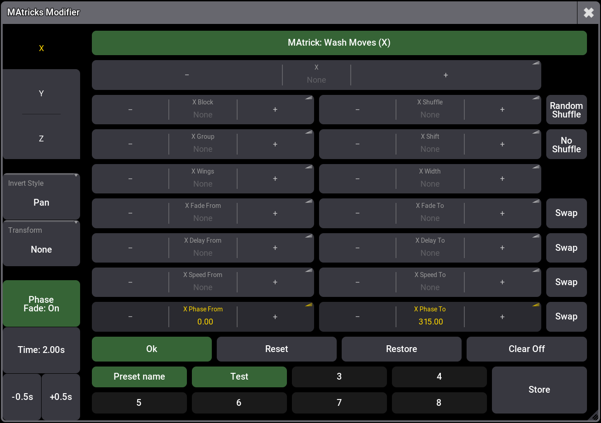

# MAtricks Modifier (grandMA3)

An on-screen editor for MAtricks on grandMA3. Edit MAtricks values for either the current Selection or a named MAtricks pool item via a tidy UI.

## Features
- Direct edit for Matricks selection and items.
- Presets naming (dubble click store)
- Editable amount of preset slot (click Matricks: header)
- Toggle Matricks clear on preset loading
- Toggle fade time for phase swaps


## Screenshot



## Files
- `gma3-matricks-modifier.lua` — the plugin script

## Install (brief)
Add as a Plugin component as you normally do:
- Paste Lua into a component, or
- Point a component to this file (FileName/FilePath), set Installed=Yes, then ReloadAllPlugins.
Reference: [grandMA3 Plugins](https://help.malighting.com/grandMA3/2.3/HTML/plugins.html).

## Usage
Create a macro and call the plugin. Examples:

- Target a specific MAtricks pool item:
```
SetUserVariable "MatricksModGroup" "My MAtricks"
Call Plugin "MAtricks Modifier"
```

- Work on current selection:
```
SetUserVariable "MatricksModGroup" "Selection"
Call Plugin "MAtricks Modifier"
```

## License
WTFPL — do what you want. See `LICENSE`.
